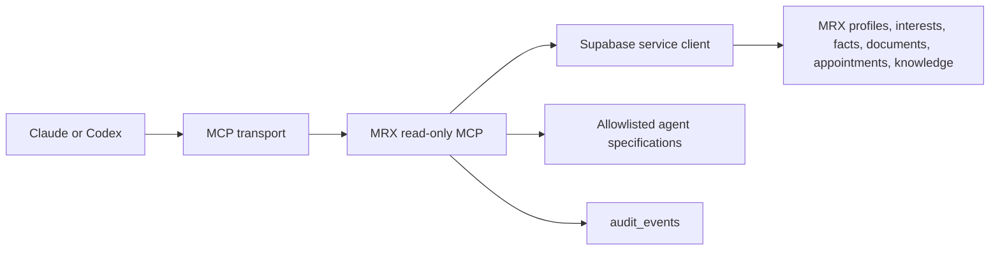

# MRX MCP Integration

## Status

The repository now contains a read-only MRX MCP server for shared use by Claude, Codex, and other authorized MCP clients.

The first release intentionally exposes no business-data write tools and no valuation tool. Imported Claude specifications are available as allowlisted MCP resources, with review status attached to each resource.

## Architecture



Local clients use stdio. The included HTTP transport is suitable for local and controlled development verification. A public production deployment must add MCP-compatible OAuth 2.1 in front of the HTTP endpoint before it is registered as a Claude remote connector.

## Exposed tools

| Tool                           | Purpose                                                | Privacy boundary                                                        |
| ------------------------------ | ------------------------------------------------------ | ----------------------------------------------------------------------- |
| `mrx_system_status`            | Verify database readiness and MCP access mode          | Returns no credentials or owner records                                 |
| `mrx_pipeline_summary`         | Aggregate interest counts by optional state/county     | No contacts or valuation amounts                                        |
| `mrx_search_mineral_interests` | Filtered search by profile, state, county, or operator | Requires at least one filter; maximum 25; excludes profile/contact data |
| `mrx_get_case_snapshot`        | Privacy-reduced case package for one profile UUID      | Excludes email, phone, messages, raw OCR, filenames, and storage paths  |
| `mrx_search_knowledge`         | Search published MRX knowledge titles                  | Draft/private knowledge excluded                                        |
| `mrx_get_knowledge_document`   | Read one published knowledge document                  | UUID required; unpublished content excluded                             |

Every tool is annotated read-only, non-destructive, and idempotent. Successful and failed reads create an `mcp.tool.read` audit event unless `MRX_MCP_AUDIT_ENABLED=false` is explicitly set.

## Exposed resources

The server publishes 14 allowlisted resources under `mrx://agent-spec/<id>`. They include the current MineralHolders Export, Excel Wizard, Acquisition Agent, Research Agent, data-pipeline, and inventory specifications.

Each resource includes a status such as:

- `canonical-extraction-spec`
- `canonical-conversation-spec`
- `requires-independent-valuation-validation`
- `role-spec-no-live-connectors`

Legacy duplicates are retained in `docs/claude-import` but are not published as MCP resources.

## Local stdio setup

Required private environment variables:

```dotenv
SUPABASE_URL=https://<project>.supabase.co
SUPABASE_SERVICE_ROLE_KEY=<server-only-key>
MRX_MCP_AUDIT_ENABLED=true
```

Start the server manually:

```bash
pnpm mcp:stdio
```

For a manual Claude Desktop MCP configuration on this Mac, use the project script so credentials remain in `.env.local` instead of the Claude configuration file:

```json
{
  "mcpServers": {
    "mrx-read-only": {
      "command": "/bin/zsh",
      "args": [
        "-lc",
        "cd '/Users/darylhill/Documents/MineralRightsXchange.com/mrx' && pnpm mcp:stdio"
      ]
    }
  }
}
```

Restart Claude Desktop after changing its local MCP configuration. The tools should appear under the conversation's connector/tool menu.

## Development HTTP setup

Generate a random token outside the repository and save it in `.env.local`. Do not commit it or put it in a URL.

```dotenv
MRX_MCP_HOST=127.0.0.1
MRX_MCP_PORT=8788
MRX_MCP_BEARER_TOKEN=<at-least-32-random-characters>
MRX_MCP_ALLOWED_HOSTS=localhost:8788,127.0.0.1:8788
MRX_MCP_ALLOWED_ORIGINS=
MRX_MCP_RATE_LIMIT_PER_MINUTE=60
MRX_MCP_MAX_BODY_BYTES=1048576
```

Start the Streamable HTTP transport:

```bash
pnpm mcp:http
```

Endpoints:

- `GET /health` — non-sensitive health response
- `POST /mcp` — authenticated Streamable HTTP MCP endpoint

The development transport enforces an exact Host allowlist, optional Origin allowlist, constant-time bearer comparison, request-size limit, and per-address rate limit. It never logs bearer tokens or tool inputs.

## Production remote connector gate

Do not expose the bearer-only endpoint directly to the public internet. Before connecting Claude's remote connector:

1. Deploy the MCP service at a dedicated HTTPS origin such as `mcp.mineralrightsxchange.com`.
2. Enable the existing Supabase project's OAuth 2.1 server with authorization-code + PKCE, dynamic client registration, and an MRX consent screen. This is the recommended identity provider because MRX already uses Supabase Auth and staff roles.
3. Map authenticated staff identities to explicit MCP scopes.
4. Keep the Supabase service-role key only in the MCP runtime.
5. Restrict network egress and rotate service credentials.
6. Add centralized rate limiting and alerting rather than relying only on the in-memory development limiter.
7. Verify that every read produces an audit event and that retention/deletion workflows include MCP activity.

Recommended Supabase OAuth setup:

- Authorization path: `https://mineralrightsxchange.com/oauth/consent`
- Separate OAuth clients for development, staging, and production
- Asymmetric JWT signing keys (`RS256` or `ES256`) so the MCP service can validate access tokens through JWKS
- Dynamic client registration for compatible MCP clients
- Custom access-token claims for MRX staff role and MCP scopes
- An authorization screen that names Claude/Codex, displays requested scopes, and requires explicit approval

Recommended initial scopes:

| Scope                | Access                                          |
| -------------------- | ----------------------------------------------- |
| `mrx:summary:read`   | Status and aggregate pipeline counts            |
| `mrx:interest:read`  | Filtered mineral-interest records               |
| `mrx:case:read`      | Privacy-reduced owner case snapshots            |
| `mrx:knowledge:read` | Published knowledge and allowlisted agent specs |

No write scope should be introduced until a separate approval, consent, idempotency, audit, and rollback design is reviewed.

## Verification

Run the focused MCP suite:

```bash
pnpm test:mcp
pnpm verify:mcp
```

The tests verify tool inventory, read-only annotations, required search filters, result caps, privacy-reduced snapshots, resource allowlisting, constant-time token behavior, exact host allowlisting, and rate limiting. The verifier launches the real stdio server, connects through the MCP protocol, lists tools and resources, and calls the non-sensitive status tool against the configured Supabase project.

## Next implementation slice

After OAuth is selected, the next safe capabilities are:

1. A versioned MineralHolders import manifest and raw-file provenance model.
2. A 42-column schema validator that quarantines drift rather than guessing.
3. A read-only import-run status tool.
4. Normalized parcel/tract, well/unit, production, title-instrument, and comps tables.
5. Only after independent review: versioned valuation runs with assumptions and human approval state.
