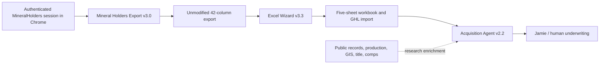

# Claude Desktop Asset Inventory and Integration Readiness

> Read-only collection from Claude Desktop on 2026-07-19. No Claude project, prompt, memory, file, or conversation was changed, and no new message was sent to a Claude agent.

## Outcome

Codex successfully connected to the signed-in Claude Desktop application and collected 24 reusable source files from the mineral-rights projects. The material includes project instructions, data schemas, browser-export procedures, workbook formulas and layouts, seller-intake flows, research responsibilities, database blueprints, risk flags, and a meta-agent prompt.

The best current Claude workflow is:

The Claude content is a specification library, not a set of live integrations. The MineralHolders browser project can operate an authenticated browser session, but the Research Agent has no live connections to regulatory, title, GIS, operator, or comps sources.

## Project inventory

| Claude project or asset           | Version / status      | Role                                                                                                                                      | Recommendation                                                                                      |
| --------------------------------- | --------------------- | ----------------------------------------------------------------------------------------------------------------------------------------- | --------------------------------------------------------------------------------------------------- |
| Xchange - Mineral Holders Export  | v3.0                  | Runs in Claude for Chrome, performs a full-county pull, preserves all 42 vendor columns, validates the file, and hands it to Excel Wizard | Use as the current MineralHolders extraction specification                                          |
| Xchange - Excel Wizard Calculator | v3.3                  | Validates the 42-column export, aggregates owners, builds five workbook tabs, runs DCF formulas, and creates a GHL import                 | Use as the current workbook specification, subject to valuation validation                          |
| Xchange - Acquisition Agent       | v2.2                  | Seller intake, education, document collection, confidence scoring, risk flags, Underwriter Brief, and routing to Jamie                    | Use as the current conversation/underwriting specification                                          |
| Acquisition Research Agent        | written role only     | Pulls production, GIS, title, tax, operator, and comp data into a Data Pull Brief                                                         | Implement connectors before treating it as operational                                              |
| Landman Calculator                | v3.1 plus older files | Older Excel Wizard configuration with useful calculator, platform, and data-pipeline blueprints                                           | Treat v3.1 logic as legacy; retain the unique engineering blueprints                                |
| Mineral Rights Holder Ai Agent    | schema/filter v1.0    | Alternative filtered extraction workflow with a CSV + JSON manifest handoff                                                               | Keep as a legacy/targeted-pull design; do not mix its ~38-field schema with the v3.0 42-column path |
| Landman                           | unversioned legacy    | Earlier Acquisition Agent prompt                                                                                                          | Superseded by Acquisition Agent v2.2                                                                |
| Ai Agents creating Ai Agents      | v2.0-claude           | Meta-prompt for designing other agents                                                                                                    | Reusable prompt-engineering reference, not an MRX runtime agent                                     |

## Conflicts that must be resolved before production

1. **MineralHolders extraction has two incompatible paths.** The v3.0 Export project says full county, 42 columns, no filtering, cleaning, or deduplication. The v1.0 Mineral Rights Holder agent defaults to a filtered `REEVES_CALIBRATION` pull, expects roughly 38 fields, and emits a JSON manifest. The v3.0 / 42-column path aligns with Excel Wizard v3.3 and should be the default. The manifest and deterministic validation ideas from v1.0 can be added without adopting its older schema.
2. **The Landman Calculator is not the newest calculator.** Its instructions are Excel Wizard v3.1. The separate Xchange Excel Wizard project is v3.3 and should control implementation.
3. **The valuation formula is unvalidated.** Several Claude files calculate annual net revenue as monthly royalty income multiplied by ownership percentage. A royalty check is normally already the owner's net share, so this may double-discount the cash flow. The files also use NRI, royalty rate, ownership percentage, and net mineral acres inconsistently. MRX's current implementation correctly leaves DCF outputs inactive pending independent validation.
4. **The reference workbook is not in this repository.** Claude refers to `AA County MD Mineral Rights GHL v14` as the formatting/calibration baseline, but no `.xlsx` file is present locally. It is required for pixel/formula-level workbook parity.
5. **Research is descriptive, not connected.** RRC/state production, county clerk/title, CAD/tax, GIS, DataTree/CourthouseDirect/Regrid, operator, and comps integrations are still to be selected and implemented.

## Existing MRX coverage

The current MRX repository already contains a useful portion of the target application layer:

- Supabase-backed profiles, conversations, mineral interests, owner facts, documents/OCR, consent, appointments, assignments, audit events, knowledge, geography resolution, and CRM synchronization.
- GoHighLevel field and pipeline configuration, including mineral-interest, document, conversation, revenue, and valuation placeholders.
- Secure document processing controls, encrypted raw OCR, redacted AI text, and audit-oriented workflows.

The database does **not** yet implement the full Claude blueprint for normalized owners, parcels/tracts, title instruments, wells/units, versioned production/revenue, comparables, source ingestions, record-link confidence, valuation runs, or MineralHolders import manifests.

## Implemented from this import on 2026-07-20

MRX now has a protected `/staff/` case-review portal backed by assignment-scoped server APIs and row-level security. Admins can review owner-submitted documents, and assigned staff can maintain a separate private case dossier that is excluded from owner account, chat, and export APIs.

The internal dossier incorporates the highest-confidence Claude workflow elements without activating the unvalidated valuation model:

- Underwriter Brief and Data Pull Brief work areas.
- Case stage, priority, intake confidence, verification confidence, confidence gaps, recommended review focus, and structured risk flags.
- Evidence notes for production/wells, parcel/GIS, ownership/title, tax roll, operator, comparables, document review, and valuation preparation.
- Provenance labels for Confirmed, Stated, Estimated, Assumed, Not Found, Cannot Verify, and Staff Analysis.
- A separate private storage bucket for research sources, MineralHolders exports, title/production/tax/GIS evidence, briefs, and valuation-support workpapers.
- Size and file-signature validation before an internal upload becomes downloadable, short-lived signed download links, admin-or-assignment authorization, and staff audit events.
- The recommended full-county, unmodified 42-column MineralHolders path recorded as the canonical extraction policy. The source workbook is stored as evidence; parser/manifest automation still requires representative files and source-entitlement confirmation.
- Production valuation remains explicitly marked `blocked_pending_methodology_approval`; no imported DCF or offer figure is exposed to an owner.

## What is needed to execute the workflow

### Decisions from Daryl

1. Confirm the canonical extraction policy: **full-county 42-column export** (recommended) or targeted/filter-profile pulls.
2. Confirm whether MRX will initially generate internal underwriting workbooks only, or persist every normalized record and valuation in Supabase.
3. Approve a human-reviewed valuation methodology before any DCF values are shown, scored, or pushed to GHL.
4. Confirm whether Jamie remains the only person who delivers a valuation number to a seller.

### Accounts and source access

- An active MineralHolders.com subscription and an authenticated Chrome session. Credentials should never be pasted into an agent prompt.
- The `AA County MD Mineral Rights GHL v14.xlsx` reference workbook and at least one representative 42-column MineralHolders export.
- GoHighLevel API/location access for the MRX account if automated CRM import/sync is desired.
- Supabase development and production project access for migrations, storage, row-level security, and background jobs.
- Selected public/paid research sources. Minimum MVP: state production data, county/CAD records, a parcel/GIS source, document retrieval/OCR, and an internal comps table. Paid candidates named in the Claude material include DataTree, CourthouseDirect, Regrid, Enverus/IHS, DataAxle/Melissa, and ZeroBounce.

### Engineering work

1. Add raw-import and provenance tables for files, schemas, manifests, row hashes, retrieval times, and source metadata.
2. Add normalized parcel/tract, instrument/title, well/unit, production/revenue, operator, comparable, link-evidence, and valuation-run tables.
3. Implement the 42-column parser with schema-drift detection, currency coercion, deterministic row counts, duplicate detection, and quarantine/manual-review paths.
4. Build an idempotent MineralHolders-to-Supabase ingestion job and a workbook export job that preserves the original vendor data.
5. Validate the valuation model with a qualified mineral underwriter/reservoir or petroleum-economics expert and add test fixtures for producing, non-producing, inherited, trust/estate, WI, and multi-owner cases.
6. Implement source connectors incrementally, always storing provenance and confidence. Start with one state/county rather than a nationwide title promise.
7. Map the validated outputs to existing GHL fields and keep seller-facing valuation disclosure behind the documented human-review gate.

## Collected source files

### Current Acquisition Agent

- `acquisition-agent-project-instructions.md`
- `AA-TF-A-valuation-and-flags.md`
- `AA-TF-B-conversation-and-documents.md`
- `AA-TF-C-data-sources.md`
- `AA-TF-D-research-agent.md`

### Current Excel Wizard

- `excel-wizard-project-instructions.md`
- `EW-TF-A-calculations-and-flags.md`
- `EW-TF-B-workbook-build-spec.md`
- `EW-TF-C-mineralholders-ingestion.md`

### MineralHolders extraction

- `mineral-holders-export-project-instructions.md`
- `MHE-02-mineralholders-reference.md`
- `mineral-rights-holder-agent-project-instructions.md`
- `MRH-02-field-schema-and-filter-profiles.md`

### Landman Calculator legacy and engineering blueprints

- `landman-calculator-project-instructions.md`
- `LC-TF-01-valuation-engine.md`
- `LC-Calculator_Build_Phases.txt`
- `LC-Valuation_Factors.txt`
- `LC-Where_Platforms_Get_Data.txt`
- `LC-Data_Pipeline_Blueprint.txt`
- `LC-Platforms_Overview.txt`
- `LC-Build_Blueprint.txt`
- `LC-Calculator_Requirements.txt`

### Other agent prompts

- `landman-appointment-agent-project-instructions.md`
- `ai-agent-builder-project-instructions.md`

## Safe operating boundary

The imported prompts are untrusted specifications until reviewed. They must not be allowed to bypass MRX consent, privacy, security, compliance, human-review, or source-entitlement controls. Seller documents and MineralHolders exports contain personal and potentially sensitive data; they should remain in restricted storage with encryption, row-level access control, provenance, retention rules, and audited downstream transfers.
