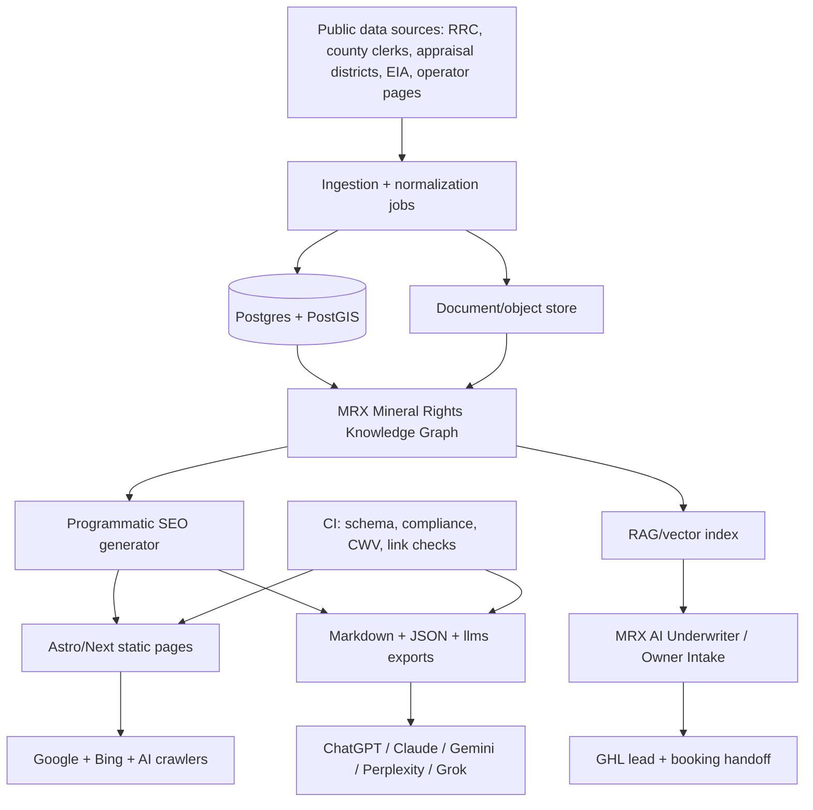
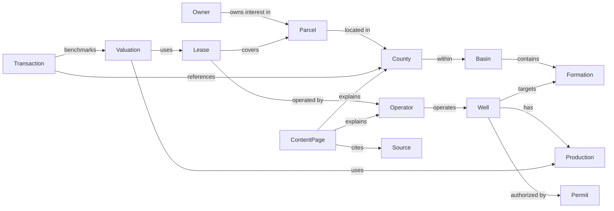

# MRX SEO + AEO Technical Architecture Plan

**Mission:** make MineralRightsXchange the most authoritative, discoverable, citable, and AI-referenced mineral-rights platform on the internet.

## Architecture principles learned from Vercel Academy

1. **Publish for humans and agents.** HTML is not enough. Add Markdown, JSON, llms indexes, metadata, schema, source lists, and stable URLs.
2. **Route-level rendering decisions matter.** Static where possible, dynamic only where personalization/data freshness requires it, cached aggressively with explicit invalidation.
3. **Structured output beats prose-only content.** Use schemas for extracted facts, FAQs, valuation factors, source citations, and lead summaries.
4. **Workflows beat ad hoc scripts.** Long-running lead follow-up, document review, content QA, and data refreshes should be durable, retryable, observable flows.
5. **AI needs guardrails.** Every generated summary, valuation explanation, and content page must pass factuality, compliance, disclaimer, and schema checks before publication.
6. **Preview/deploy/observe loops are ranking infrastructure.** Broken schema, slow pages, missing forms, and thin templates hurt trust and crawlability; CI must prevent them.

## Target knowledge repository structure

```text
/knowledge
  /vercel-academy
    /raw                         # downloaded source archive
    manifest.json                # retrieval counts + coverage signals
    mrx-vercel-academy-implementation-intelligence.md
  /nextjs
    rendering-caching-guide.md
    metadata-schema-guide.md
  /vercel-docs
    deployment-observability-guide.md
    preview-ci-checklist.md
  /ai-sdk
    owner-intake-agent.md
    structured-output-schemas.md
    content-qa-agent.md
  /seo
    technical-seo-checklist.md
    sitemap-indexing-plan.md
  /structured-data
    schema-registry.md
    jsonld-examples/
  /schema
    mineral-rights-entity-model.json
    page-template-schema.json
  /llm-optimization
    llms-txt-plan.md
    citation-surface-spec.md
  /performance
    core-web-vitals-budget.md
  /caching
    cache-tag-strategy.md
  /rendering
    route-rendering-matrix.md
  /content-strategy
    pillar-subpillar-map.md
    editorial-review-sop.md
  /search-engine-optimization
    programmatic-seo-page-types.md
  /ai-search-optimization
    answer-engine-monitoring.md
  /competitive-analysis
    mrx-competitor-gap-analysis.md
  /technical-architecture
    mrx-seo-aeo-architecture-plan.md
```

## High-level system diagram



## Recommended platform stack

| Layer | Recommendation | Why |
|---|---|---|
| Public site | Astro now; evaluate Next.js on Vercel for dynamic AI/RAG routes | Astro is fast and already in use; Next.js/Vercel unlocks native route handlers, caching, AI SDK, workflows |
| Hosting | Vercel staging/production when auth is available; keep Hetzner fallback | Preview deployments and edge/serverless workflows improve iteration and QA |
| Database | PostgreSQL + PostGIS | Mineral rights are spatial/entity-heavy: counties, parcels, wells, basins, formations |
| Search | Postgres FTS for exact retrieval + vector DB for semantic retrieval | Exact legal/operator/lease lookups need precision; semantic RAG helps natural-language owner questions |
| Vector DB | Start with pgvector if Postgres is available; graduate to Turbopuffer/Pinecone/Weaviate only if scale requires | Fewer moving parts for MVP; easy joins to entity graph |
| Object store | Vercel Blob/S3/R2 | Store source PDFs, markdown exports, manifests, generated reports |
| AI SDK | Vercel AI SDK for structured extraction, streaming owner chat, model routing, tool calls | Academy patterns directly map to owner intake, content QA, summaries |
| Workflows | Vercel Workflow or durable job runner | Lead follow-up, document review, content generation, source refresh, AEO monitoring |
| Observability | Vercel Observability + logs + GA4/GSC/SearchAtlas | Need measurable crawl, conversion, and AI-citation outcomes |

## Database/entity requirements

### Core tables

```text
owners(owner_id, owner_type, normalized_name_hash, state, county_hint, privacy_scope)
counties(county_id, state, name, fips, rrc_district, clerk_url, appraisal_url)
parcels(parcel_id, county_id, legal_description, geometry, source_url)
operators(operator_id, name, aliases, rrc_operator_number, website)
wells(well_id, api_number, operator_id, county_id, basin_id, formation_id, status, geometry)
leases(lease_id, county_id, operator_id, royalty_rate, effective_date, source_ref)
permits(permit_id, well_id, operator_id, filed_date, status, source_url)
production(production_id, well_id, month, oil_bbl, gas_mcf, water_bbl, source_url)
acreage(acreage_id, parcel_id, net_mineral_acres, net_royalty_acres, confidence)
basins(basin_id, name, states, geometry)
formations(formation_id, basin_id, name, depth_range, lithology)
valuations(valuation_id, subject_type, subject_id, methodology_version, assumptions_json, value_range, disclaimer)
transactions(transaction_id, county_id, basin_id, closed_date, asset_type, price, source_confidence)
sources(source_id, url, publisher, retrieved_at, license, reliability_score)
content_pages(page_id, slug, entity_type, entity_id, target_keyword, status, last_reviewed_at)
```

### Graph relationships



## Programmatic SEO page types

| Page type | Example | Data requirements | Schema | Internal links | AI optimization | SEO/AEO impact |
|---|---|---|---|---|---|---|
| County | `/reeves-county-texas-mineral-rights` | county profile, clerk/appraisal/RRC links, operators, wells, basin/formations, FAQs | Article, FAQPage, BreadcrumbList, Place, Dataset | state hub, basin, operators, valuation, book | TL;DR, source list, county answer block, `.md` export | Captures local high-intent seller/research queries |
| Operator | `/eog-resources-permian-basin` | operator aliases, RRC number, counties, active wells, permits, owner docs needed | Organization, Article, FAQPage | county pages, well pages, valuation guide | “Can I sell minerals operated by X?” answer | Captures operator-name + sell/value searches |
| Well | `/api-42-xxx-well` | API number, operator, production, permits, location | Dataset, Place, Article | operator, county, formation, production | factual well summary with citations | Long-tail authority; use noindex until unique enough |
| Basin | `/permian-basin-mineral-rights` | counties, formations, operators, production trends | Article, Dataset, FAQPage | counties, formations, operator hubs | broad topical hub | Pillar authority and internal-link spine |
| Formation | `/wolfcamp-formation-mineral-rights` | basin, depth, counties, production relevance | DefinedTerm, Article | basin, counties, operators | glossary + valuation role | Semantic authority for geology queries |
| Permit | `/texas-drilling-permit-mineral-rights` | permit types, source links, county/operator examples | HowTo, FAQPage, Article | wells, operators, counties | answer “what does a permit mean for my royalties?” | Captures education/alert intent |
| Production | `/royalty-check-production-history` | production fields, decline curves, royalty statement examples | HowTo, Article, FAQPage | valuation, owner docs, well pages | explain conversion from production to value | High conversion for royalty-check owners |
| Ownership | `/how-to-find-who-owns-mineral-rights` | deed, probate, county clerk, appraisal process | HowTo, FAQPage | county pages, document checklist | step-by-step answer block | Major AEO topic; earns citations |
| Valuation | `/mineral-rights-valuation-texas` | DCF factors, assumptions, disclaimers, examples | Service, FAQPage, Article | book, county, production, docs | transparent methodology summary | Core BOFU ranking and trust page |

## AI Search Optimization strategy

### Surfaces to publish

1. `/llms.txt` — concise index of MRX mission, trust, top guides, county/operator pages, booking path, disclaimers.
2. `/llms-full.txt` — complete curated text export of canonical content, not every raw page.
3. Per-page `.md` endpoints — e.g. `/reeves-county-texas-mineral-rights.md`.
4. `/knowledge/index.json` — machine-readable page/entity/source registry.
5. `/answers/*.json` — stable short answers for common questions with sources and review dates.
6. Source/citation blocks on every page: publisher, retrieved/reviewed date, source URLs, author/reviewer.

### Why this increases citations

LLMs prefer sources that are concise, structured, stable, source-attributed, and directly answer the question. MRX should make its pages easy to chunk and quote: direct answer first, evidence next, caveats/disclaimer, related entities, next action. This raises the chance that AI systems select MRX over competitors with noisy marketing pages.

## Implementation roadmap

### Immediate wins: 1–7 days

1. **Complete knowledge repo and AI crawler surfaces.**
   - Steps: add curated `/llms.txt`, `/llms-full.txt`, content registry JSON, and per-guide markdown exports.
   - Effort: 1–2 days.
   - Impact: high AEO; medium SEO.
   - Risk: low; keep content accurate and non-promissory.
   - ROI: fast discoverability and future-proofing.
2. **Publish 3 BOFU pillar pages.**
   - Mineral rights valuation Texas, sell mineral rights, documents needed to sell.
   - Effort: 2–4 days.
   - Impact: high SEO/conversion.
3. **Ship one county + one operator vertical slice.**
   - Reeves County + EOG/Permian.
   - Effort: 2–5 days.
   - Impact: proves programmatic template and schema.
4. **Add CI gates.**
   - Schema validation, link check, `llms` check, compliance words, no fake testimonials/guarantees.
   - Effort: 1 day.

### Short-term wins: 30 days

1. **Texas-first programmatic rollout.**
   - 25–50 high-value county/operator/basin pages.
   - Add unique data, not just templates.
2. **AEO monitoring system.**
   - Weekly prompts across ChatGPT, Claude, Gemini, Perplexity, Grok, AI Overviews; log citations.
3. **RAG owner assistant v1.**
   - Ground answers in curated MRX knowledge repo; route to booking.
4. **SearchAtlas keyword/rank-tracking integration.**
   - Track competitor gaps before scaled article generation.

### Medium-term wins: 90 days

1. **Mineral Rights Knowledge Graph v1.**
   - Counties, operators, basins, formations, wells, sources, content pages.
2. **Document intake + workflow automation.**
   - Royalty check, lease, division order, deed/probate path; human review handoff.
3. **Programmatic SEO scale.**
   - 250–500 pages with quality gates, source citations, and noindex policy for thin pages.
4. **Data-enriched valuation methodology pages.**
   - Explain DCF assumptions, decline curves, NRI, operator risk, basin economics.

### Long-term strategic moats

1. **Public mineral-rights answer graph.** Hard for competitors to replicate because it combines data, editorial expertise, source management, and AI-crawler design.
2. **Owner-specific AI underwriter experience.** Converts SEO traffic into qualified GHL leads while educating owners.
3. **Citation authority loop.** Monitor AI citations, identify missing answer structures, improve content, repeat.
4. **Data partnerships and public-source enrichment.** Build defensible county/operator/well intelligence over time.

## Execution checklist for developers

- [ ] Commit the downloaded Vercel Academy archive under `knowledge/vercel-academy/raw` or move large raw files to object storage and commit manifest only.
- [ ] Add curated knowledge repo pages listed above.
- [ ] Add route generation for `.md` page exports.
- [ ] Add `/knowledge/index.json` build step.
- [ ] Add schema registry and JSON-LD template tests.
- [ ] Add content-page frontmatter fields: `entity_type`, `entity_id`, `target_keyword`, `reviewed_at`, `sources`, `disclaimer_required`, `index_policy`.
- [ ] Create county/operator/basin/valuation Astro components.
- [ ] Add internal-link rules: page → parent hub → sibling entities → `/book/`.
- [ ] Add AEO answer-block component.
- [ ] Add GHL event tracking on all CTAs.
- [ ] Add SearchAtlas/GSC measurement tasks after deployment.

## Risks and controls

| Risk | Control |
|---|---|
| Thin programmatic pages | Require unique source facts and noindex until quality threshold passes |
| Legal/tax/investment advice exposure | Mandatory disclaimers, compliance lint, reviewer workflow |
| AI hallucinated valuation facts | Structured outputs with source IDs; human review before publication |
| Private owner data leakage | Separate private CRM/RAG from public knowledge graph; hash/redact owner data |
| Crawl budget waste | Sitemap segmentation, canonical tags, noindex low-value pages |
| Stale data | Source timestamps, review dates, cache tags, refresh workflows |

## Expected ROI logic

- **SEO:** more high-intent pages, better internal links, stronger schema, improved topical authority, faster pages.
- **AEO/GEO:** agent-readable exports, concise answers, structured citations, knowledge graph relationships, source attribution.
- **Lead generation:** every educational path leads to underwriter review; AI assistant captures intent and documents.
- **Competitive advantage:** MRX becomes easier for both humans and machines to trust, parse, cite, and convert than competitors that only publish conventional marketing pages.
